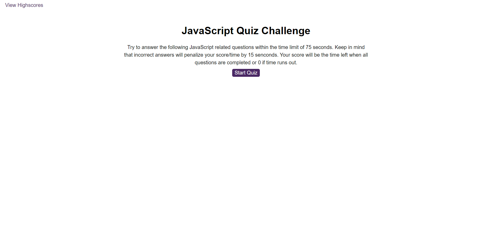

# javascript-quiz-challenge
JavaScript timed quiz that stores high scores to compare the progress.

## Description
When the page loads, the user is presented to take the quiz. The quiz works as follows:
- User clicks start button to start the game.
- User is presented with a question with multiple choices.
- When user answers the question, user is presented with next question.
- Total 5 questions are presented to user.
- User has time limit of 75 seconds to complete all 5 questions.
- If user answer incorrectly, 15 seconds are deducted from remaining time.
- When user answers all 5 questions or timer reaches 0, the game is over.
- When the game is over, user is presented with the score.
- User can save the score with the initials.
- User can also see all the high scores for the game where user can compare the scores.

## Deployment
The webpage is deployed to GitHub pages. Use below link to visit the webpage: https://nileshpatel83.github.io/javascript-quiz-challenge/

## Screenshot

## License
Please refer to the LICENSE in the repo.
